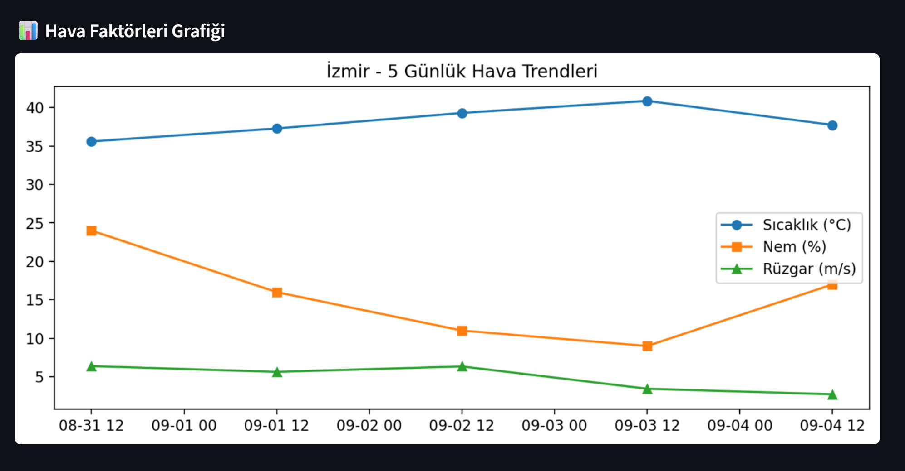

# Türkiye'de Orman Yangını Analizi ve Tahmini

Türkiye'de yaşanan sık orman yangınları nedeniyle bu analiz projesi **Filiz Buzkıran (@lizlavigne), Göknil Bilge (@GoknilBilge) ve Ada Erkan (@adaerkn)** tarafından geliştirilmiştir.

Bu proje, Türkiye'deki orman yangınlarının riskini tahmin etmek için tasarlanmış ileri düzey bir makine öğrenimi uygulamasıdır. Tarihi yangın ve meteorolojik veriler üzerinde eğitilmiş bir **Random Forest Classifier** modeli kullanarak gerçek zamanlı ve 5 günlük risk tahmini sağlar. Uygulamamız, etkileşimli bir kullanıcı arayüzü için **Streamlit** ile, coğrafi görselleştirmeler için ise Folium ile geliştirilmiştir.

## Temel Özellikler
* ***Makine Öğrenimi Tahminleri:*** Tarihsel yangın ve hava verileri üzerinde eğitilmiş bir Random **Forest Classifier** modeli ile orman yangını olasılığı tahmin edilir.

* ***Gerçek Zamanlı Hava Durumu Entegrasyonu:*** **OpenWeatherMap API** üzerinden canlı ve 5 günlük hava durumu verileri çekilir.

* ***Etkileşimli Web Uygulaması:*** **Streamlit** ile geliştirilen uygulama, şehir seçme, risk tahminlerini görüntüleme ve hava durumu trendlerini analiz etme gibi kullanıcı dostu özellikler sunar.

* ***Coğrafi Görselleştirme:*** Etkileşimli bir **Folium** haritası, **2020'den 2024'e kadar** olan yangın olaylarını ve gelecekteki potansiyel risk bölgelerini görselleştirir.

* ***Kapsamlı Veri Seti:*** Proje, **NASA'nın uydu yangın verileri ve Meteostat API'sinin meteorolojik** verilerinin birleşiminden oluşan zengin bir veri seti kullanır.

## Proje Yapısı
* `training_model.py`: Makine öğrenimi iş akışını yönetir. Verileri yükler, ön işler, Random Forest modelini eğitir ve daha sonra kullanılmak üzere eğitilmiş modeli .pkl dosyasına kaydeder.
* `app.py`:  Ana uygulama dosyasıdır. Önceden eğitilmiş modeli yükler, OpenWeatherMap API ile etkileşime geçer, yangın riskini hesaplar ve sonuçları Streamlit ve Folium kullanarak görselleştirir.
* `tüm_veriler_birlesik_2020-2024.csv`: Projenin birincil veri setidir. Makine öğrenimi modelini eğitmek için kullanılan tarihi yangın ve hava durumu bilgilerini içerir.
*  `orman_yangini_model.pkl`: `training_model.py` tarafından oluşturulan ve  `app.py` 
tarafından tahmin yapmak için kullanılan serileştirilmiş makine öğrenimi modelidir.
* `requirements.txt` : Projemizde kullandığımız kütüphaneleri içeren txt dosyamız.
  (streamlit,pandas,scikit-learn,folium,requests)

  
## Nasıl Kullanılır

Bu proje, büyük dosyaları işlemek için **Git LFS (Large File Storage)** kullanır. Uygulamamızı sorunsuz bir şekilde çalıştırmak için aşağıdaki adımları izleyin:

1. ***Git LFS'i Kurun:*** Terminalinizde aşağıdaki komutu çalıştırarak sisteminizde Git LFS'in kurulu olduğundan emin olun.

   `git lfs install`
   
2. ***Depoyu Klonlayın:*** Depoyu normal bir şekilde klonlayın. 

  `git clone https://github.com/adaerkn/wildfire_analysis_in_Turkiye.git`
  
3. ***Proje Klasörüne Girin:*** Proje dizinine gidin.
      
 `cd wildfire_analysis_in_Turkiye`
 
  *  **3.1 Gerekli Kütüphaneleri Kurun:** requirements.txt içinde bulunan gerekli kütüphaneler çalıştırılır

   `pip install -r requirements.txt`
    
  * **3.2 Modeli Eğitimi:** Modelimizin eğitilmiş halinin sonucu görünür. (pandas ve sklearn modülleri indirilmiş olmalı değilse lütfen önce onu indirin)
    
 `python training_model.py`

  * **3.3 Arayüzü Başlatın:**
Bu komut, uygulamayı  web tarayıcınızda açacaktır.

 `streamlit run app.py`

## Application Screenshots
Here are some screenshots to give you a better idea of the application's interface:

### 

### 

### 

### 

---------
# Wildfire Risk analysis in Türkiye
Due to the frequent wildfires in Turkey, we were developed that analysis project by **Filiz Buzkıran (@lizlavigne) ,  Göknil Bilge (@GoknilBilge) and Ada Erkan (@adaerkn)**.

This project is an advanced machine learning application designed to predict the risk of wildfires in Turkey. It uses a **Random Forest Classifier** model, trained on historical fire and meteorological data, to provide real-time and 5-day risk forecasts. The application is built with **Streamlit** for an interactive user interface and uses **Folium** for geospatial visualization.

## Key Features

* ***Machine Learning-Powered Predictions:*** Utilizes a **Random Forest Classifier** trained on historical fire and weather data to predict the likelihood of a forest fire.
* ***Real-Time Weather Integration:*** Fetches live and 5-day forecast weather data from the **OpenWeatherMap API**.
* ***Interactive Web Application:*** Built with **Streamlit**, the app provides a user-friendly interface for selecting a city, viewing risk predictions, and analyzing weather trends.
* ***Geospatial Visualization:***  An interactive **Folium map** displays historical fire events from 2020 to 2024 and visualizes potential future risk zones.
* ***Comprehensive Data Set:*** The project uses a rich dataset compiled from NASA's satellite fire data and meteorological data from the Meteostat API.

## Project Structure

* `training_model.py`: This script handles the core machine learning workflow. It loads and preprocesses data, trains the Random Forest model, and saves the trained model to a `.pkl` file for later use.
* `app.py`: The main application file. It loads the pre-trained model, interacts with the OpenWeatherMap API, calculates the fire risk, and visualizes the results using Streamlit and Folium.
* `tüm_veriler_birlesik_2020-2024.csv`: The primary dataset for the project. A dataset containing historical fire and weather information used to train the machine learning model.
* `orman_yangini_model.pkl`: The serialized machine learning model, created by `training_model.py` and used by `app.py` for making predictions.
* `requirements.txt`: A text file that lists all the Python libraries used in our project, such as `streamlit`, `pandas`, `scikit-learn`, `folium`, and `requests`.

## How to Use

This project uses **Git LFS (Large File Storage)** to handle large files. To run the application smoothly, follow these steps:

1. ***Install Git LFS:*** Ensure Git LFS is installed on your system by running the following command in your terminal.
   
    `git lfs install`

2. ***Clone the Repository:*** Clone the repository as you normally would. Git LFS will automatically handle the download of the large files.
 
    `git clone https://github.com/adaerkn/wildfire_analysis_in_Turkiye.git`

3. ***Run the Application:*** Navigate to the project directory.(pandas and sklearn modules must be downloaded, if not please download them first)
 
    `cd wildfire_analysis_in_Turkiye`

    * **3.1 Install Required Libraries:**  Run this command to install the necessary libraries listed in
      
    `pip install -r requirements.txt`
      
    * **3.2 Train the Model:** If you want to retrain the model with your own data or update the existing one, run the following command. The result will be an updated, trained model.
    
    `python training_model.py`

    * **3.3 Launch the Interface:**
    This command will open the application in your web browser.
    
    `streamlit run app.py` 
